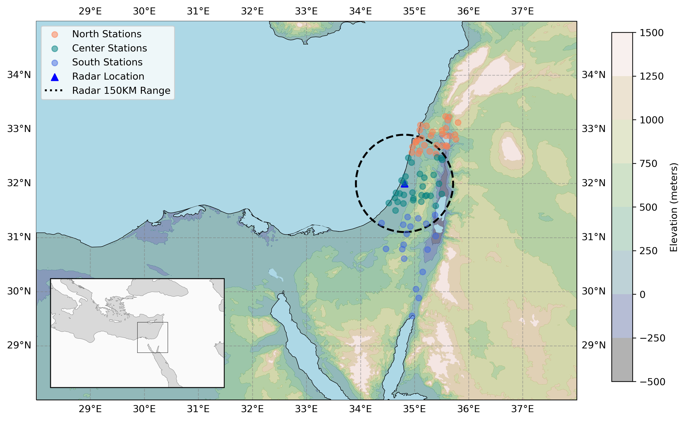
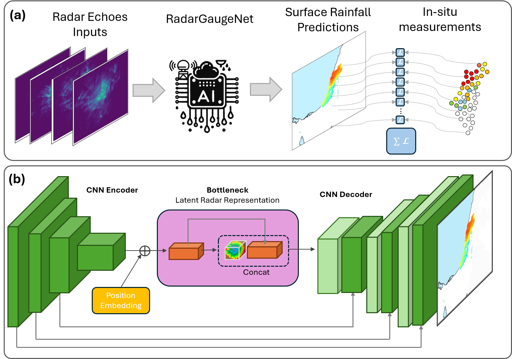
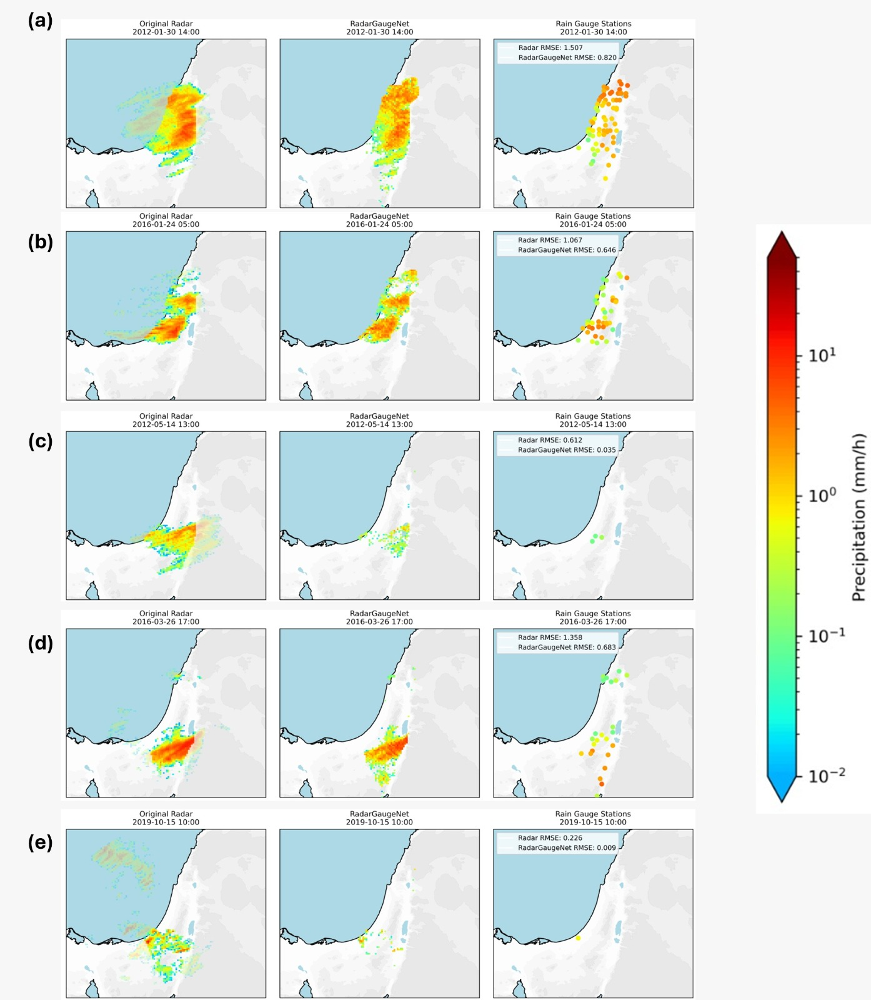

# RadarGaugeNet: Radar-Rain-Gauge based AI Architecture for Real-time Quantitative Precipitation Estimation

## Overview

This repository contains the code and data used in the study "*RadarGaugeNet: Radar-Rain-Gauge based AI Architecture for Real-time Quantitative Precipitation Estimation,"* which introduces a deep learning approach for accurate, real-time Quantitative Precipitation Estimation (QPE). The project addresses challenges in precipitation measurement caused by radar biases and interpolation artifacts by developing RadarGaugeNet - a U-Net-based model supervised solely by rain gauge observations. 
## Authors
- **Ron Sarafian** - Earth and Planetary Science Department, Weizmann Institute of Science, Israel
- **Meira Barron** - Department of Statistics and Data Science, Hebrew University of Jerusalem, Israel
- **Dori Nissenbaum** - Weizmann Institute of Science, Israel
- **Yoav Levi** -  Israel Meteorological Service, P.O. Box 25, Bet Dagan 5025001, Israel
- **Yinon Rudich** - Earth and Planetary Science Department, Weizmann Institute of Science, Israel

For inquiries, please contact [ronsarafian@gmail.com](mailto:ronsarafian@gmail.com) or [yinon.rudich@weizmann.ac.il](mailto:yinon.rudich@weizmann.ac.il).

## Abstract
This study proposes a deep-learning approach to correct radar-based rainfall estimation using in-situ rain gauge measurements across Israel. By training a U-Net-based model with radar data supervised only by ground truth observations, we produce high-resolution, bias-corrected Quantitative Precipitation Estimates (QPE). RadarGaugeNet significantly improves rain event detection across diverse regions and rainfall intensities, with increased F1 scores in all regions and reducing surface rainfall estimation errors compared to the IMS radar. The model enhances real-time rainfall mapping, offering a robust alternative to traditional radar and reanalysis products.

## Table of Contents

- [Introduction](#introduction)
- [Data](#data)
- [Methodology](#methodology)
- [Results](#results)
- [Usage](#usage)
- [Data Availability](#data-availability)
- [Citation](#citation)

## Introduction

Accurate, real-time Quantitative Precipitation Estimation (QPE) is critical for sectors such as hydrology, agriculture, and emergency management, yet remains challenging due to the complex spatiotemporal variability of rainfall. While rain gauges provide reliable point measurements, their sparse coverage leads to interpolation errors, and radar observations, despite offering high-resolution data, suffer from biases related to beam overshooting, attenuation, and non-linear reflectivity-rain rate relationships. Traditional radar-rain gauge integration methods introduce additional biases due to interpolation assumptions. This study presents RadarGaugeNet, a novel deep-learning architecture that generates continuous, high-resolution real-time QPEs using radar data supervised solely by rain gauge observations. Trained on a decade of rainfall data from Israel, RadarGaugeNet learns spatially varying radar error patterns without relying on explicit geographic inputs, outperforming both radar-based and reanalysis QPEs in precision, recall, and RMSE, and providing a scalable solution for accurate rainfall estimation across diverse environments.
## Data

The study relies on the following datasets:

1. **Rain Gauge Measurements**: In-situ rainfall data from 80 automated meteorological stations across Israel, collected at 10-minute intervals and aggregated to 1-hour blocks, covering 2010-2020. 
2. **INCA Rain Radar-Gauge**: High-resolution precipitation estimates from the Integrated Nowcasting through Comprehensive Analysis (INCA) system operated by the Israel Meteorological Service (IMS). 
3. **ERA5-Land Reanalysis**: Hourly total precipitation estimates from the ERA5-Land dataset by the European Centre for Medium-Range Weather Forecasts (ECMWF), at approximately 9 km spatial resolution.
the study area experiences a Mediterranean climate characterized by wet winters and dry summers. A diverse topography, including mountains, coastal plains, and deserts, creates variable rainfall patterns. The image below shows the region where the model was trained and tested:

## Methodology
RadarGaugeNet’s training scheme and architecture are shown in the diagram below:

The workflow consists of two main stages:

### Training Framework
RadarGaugeNet is trained in an image-to-image translation setup, where the loss is computed only at rain gauge locations — treated as sparse observations from a continuous rainfall surface. Rain gauge measurements are mapped to their corresponding grid cells before training. During each batch, the model predicts a full high-resolution rainfall field, and the loss is aggregated over all valid rain gauge points to supervise learning.
### Model Architecture
RadarGaugeNet is a U-Net-based encoder-decoder architecture. The input radar field (128×128 pixels) passes through a CNN encoder, then a positional embedding is added before entering the bottleneck, which contains densely connected convolutional layers that maintain spatial resolution. The decoder mirrors the encoder with skip connections to preserve high-resolution details. The model outputs a continuous, geo-located rainfall field covering the study area.

### Evaluation
For binary classification of rain events performances are assessed using precision, recall,
and F1 score
The nowcasting model was evaluated using RMSE for continuous rainfall estimation, and precision, recall, F1 score, and accuracy for binary classification of rain events.

## Results
- **Estimation Effectiveness**: RadarGaugeNet reduced average RMSE to 0.62 mm/h compared to 0.76 mm/h for the IMS radar, consistently improving the accuracy of continuous rainfall estimation across all stations.
- **Detection Improvement**: RadarGaugeNet consistently outperformed both IMS radar and ERA5-Land reanalysis in binary rain event detection across all regions, with particularly strong Improvement in the northern region, where it achieved F1 scores more than 10 percentage points higher than the IMS radar.
- **Coverage Refinement**: RadarGaugeNet successfully reconstructed rainfall fields in regions where radar performance degraded, such as the Upper Galilee, Golan Heights, and southern deserts, demonstrating robust inference beyond radar range.
RadarGaugeNet significantly reduces rainfall estimation error compared to IMS radar.

The following images compare radar observations, ground truth rain gauge data, and RadarGaugeNet reconstructions across test examples:

## Data Availability

All data used in this study is publicly accessible:

- **IMS Radar**:[https://ims.gov.il/he/RadarSatellite]( https://ims.gov.il/he/RadarSatellite)
- **IMS In-Situ Stations**:[https://ims.gov.il/he/AccumulatedRain]( https://ims.gov.il/he/AccumulatedRain)
- **INCA**:[https://ims.gov.il/en/INCA]( https://ims.gov.il/en/INCA)
- **ERA5-Land Reanalysis**:[https://cds.climate.copernicus.eu/datasets/reanalysis-era5-single-levels?tab=overview](https://cds.climate.copernicus.eu/datasets/reanalysis-era5-land?tab=overview)

---

This README provides an overview of the RadarGaugeNet methodology, along with the resources needed to implement and evaluate the model. Contributions and feedback are welcome to further improve real-time rainfall estimation and nowcasting accuracy.
